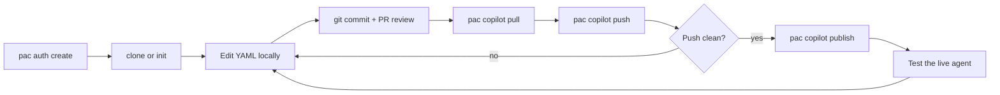

# CLI Authoring for Copilot Studio (`pac copilot`)

<!-- Upstream: microsoft/copilot-studio-plugin — agents/copilot-studio-manage.md, copilot-studio-init.md,
     copilot-studio-architect.md, commands/chat.md (accessed 2026-08-22).
     Adapted for Sopra conventions. See UPSTREAM_REFS.md entry 3. -->

> Copilot Studio agents can be authored as **YAML files in source control** instead of only in the
> maker portal. This unlocks real code review, diffs, branching, and CI — the things the portal
> cannot give us. This document is the Sopra reference for that workflow.

---

## 1. Prerequisites

| Requirement | Version / Notes |
|---|---|
| Power Platform CLI (`pac`) | **Greater than 2.9.3.** Earlier versions do not support `pac copilot`. |
| Node.js | 18+ (only needed for the plugin's helper scripts) |
| Authenticated PAC profile | `pac auth create` |

See [`../shared/tools-and-setup.md`](../shared/tools-and-setup.md) for installation.

Verify before you start:

```powershell
pac --version
```

If the version is 2.9.3 or lower, upgrade. The `pac copilot` command group will either be missing or
behave incorrectly.

---

## 2. Project Layout

A CLI-authored ("modern") agent project looks like this:

```text
<agent-project>/
├── settings.mcs.yml            # Global agent settings + instructions
├── agent.sync.yaml             # Sync metadata
├── behaviors/                  # Skills (InlineAgentSkill components)
├── capabilities/
│   ├── knowledge/              # Knowledge source definitions
│   │   └── files/              # Uploaded knowledge files + sidecar YAML
│   └── tools/                  # ConnectorTool / WorkflowTool / MCP tool definitions
├── infrastructure/
│   └── connections/            # Connection references
└── .mcs/
    └── conn.json               # CLI-managed environment binding — NEVER hand-edit
```

A **classic** (legacy) agent folder looks different — this is how you tell them apart:

```text
<classic-agent>/
├── actions/                    # Legacy action YAML
├── topics/                     # Legacy topics
├── workflows/                  # Power Automate workflow packages
├── knowledge/
└── .mcs/
```

If you see `topics/` and `actions/`, you are looking at a classic agent. See
[`patterns/migration-classic-to-agentic.md`](patterns/migration-classic-to-agentic.md).

### `.mcs/conn.json`

CLI-managed state holding the environment binding. Two fields matter when reading it:

- `EnvironmentId` — the target Dataverse environment
- `AgentId` — the agent's Dataverse bot ID

**Never hand-edit anything under `.mcs/`.** Treat it the way you treat `.git/`.

---

## 3. Component File Conventions

Every authored `*.mcs.yml` component file — except `settings.mcs.yml` — starts with:

```yaml
mcs.metadata:
  componentName: <human-friendly display name>
  description: <one-line description>
kind: <component kind>
```

File names use a slugified component name plus a short unique suffix:

```text
answer-refund-questions_a1B2c3.mcs.yml
```

**Keep the existing generated suffix when editing an existing file.** Changing it creates a new
component rather than updating the old one.

### Push-blocking constraint

Every bot-component file stem must:

1. Start with a valid **publisher prefix** for the target environment, and
2. Be **no more than 100 characters** long.

```text
spr_answer-refund-questions_a1B2c3.mcs.yml
```

Sopra uses the prefix **`spr`**. Rename files *before* push — a violation fails the whole push.

---

## 4. Component YAML Reference

### Global instructions — `settings.mcs.yml`

```yaml
configuration:
  agentSettings:
    instructions:
      segments:
        - kind: StaticSegment
          value: |
            You are the Sopra HR self-service assistant.
            Scope: leave balances, leave requests, and published HR policy.
            Never speculate about an employee's contractual terms — escalate instead.
```

Supported modern model series: `GPT5Chat`, `GPT55Chat`, `Sonnet46`, `Opus47`.

**Preserve identity fields.** Never modify `schemaName`, environment binding, connection references,
template, language, or generated IDs unless you specifically intend to.

### Knowledge — SharePoint

Path: `capabilities/knowledge/<schemaName>.<FriendlyName>_<id>.mcs.yml`

```yaml
mcs.metadata:
  componentName: HR-Policies
  description: HR policy documents published on the HR SharePoint site.
kind: KnowledgeSourceConfiguration
source:
  kind: SharePointKnowledgeSource
  siteUrl: https://<tenant>.sharepoint.com/sites/<Site>/Shared%20Documents/HR-Policies
  additionalSearchTerms:
  targetKind: Folder
```

### Knowledge — uploaded file

Copy the file into `capabilities/knowledge/files/`, then add a sidecar named
`<filename>.<ext>.mcs.yml` beside it:

```yaml
mcs.metadata:
  componentName: hr-policies-france.pdf
  description: HR policies applicable in France.
```

Do **not** create a sidecar for a file that is not actually present.

### Tool — connector

```yaml
mcs.metadata:
  componentName: Send email with options
  description: Sends an email with multiple options and waits for the recipient to respond.
kind: ConnectorTool
authMode: Invoker
connectionReference: <schemaName>.cr.shared_office365
connectorId: /providers/Microsoft.PowerApps/apis/shared_office365
operationId: SendMailWithOptions
toolInputs:
  - name: optionsEmailSubscription.Message.To
    value:
      kind: ValueReference
      type: "{\"type\":\"string\"}"
      defaultValue: "\"user@example.com\""
```

Other tool kinds: `WorkflowTool` (a converted Agent Flow) and MCP tools.

### Skill

Path: `behaviors/<slug>_<suffix>.mcs.yml`

```yaml
mcs.metadata:
  componentName: submit-leave-request
  description: Guides the employee through submitting a leave request.
kind: InlineAgentSkill
content: |
  ---
  name: submit-leave-request
  description: Guides the employee through submitting a leave request.
  ---
  <skill instructions in Markdown>
```

Skill `content` should cover: when to use it, required inputs, clarifying questions to ask, the
tool-call sequence, confirmation rules for anything with side effects, expected output format, and
fallback/escalation behaviour.

---

## 5. Command Reference

### Authenticate

```powershell
pac auth create
```

Required before any remote command. If a command fails with an auth or profile error, re-run this.

### Initialize a new project

```powershell
pac copilot init `
  --name "<Agent Display Name>" `
  --publisher-prefix spr `
  --authoring-mode cli-copilot `
  --project-dir "<target-project-dir>" `
  --environment "<environment-id>"
```

- `--authoring-mode cli-copilot` is fixed — always use it.
- `--publisher-prefix` must be 2–8 alphanumeric characters, start with a letter, and must not start
  with `mscrm`. **Sopra uses `spr`.** The tooling default is `catmgr` — override it.
- **Not idempotent.** Each run creates a new empty project, and it stops if the target directory
  already exists.

### Clone an existing agent

```powershell
pac copilot clone `
  --bot "<bot-id-or-schema-name>" `
  --environment "<environment-id-or-dataverse-url>" `
  --output-dir "<target-output-root>"
```

Optional `--display-name "<local-folder-name>"` controls the subfolder name. PAC writes into a
subfolder named after the agent's display name. Afterwards, confirm `settings.mcs.yml` and `.mcs/`
exist.

### Pull, push, publish

```powershell
# Always pull before pushing
pac copilot pull --project-dir "<agent-folder>"
pac copilot push --project-dir "<agent-folder>"

# Publishing is a separate, deliberate step
pac copilot publish --bot "<bot-id-or-schema-name>" --environment "<environment-id-or-dataverse-url>"
```

### List

```powershell
pac copilot list --environment "<environment-id-or-dataverse-url>"
pac connection list --environment "<environment-id>"
```

### Commands Sopra does not use

`pac copilot pack` — **never run this.** Also out of scope for the CLI authoring flow:
`pac copilot create`, `delete`, `quarantine`, status polling, translations, AI model commands, and
MCP commands.

---

## 6. The Working Loop



Rules Sopra enforces on this loop:

1. **Always pull before push.** No exceptions.
2. **Never publish a no-op push.** If push reports nothing to send, stop.
3. **Always warn before publishing** — publish makes the agent live for every shared user.
4. **Never use time-based waits.** Wait for the actual command to return.
5. **Code review happens on the YAML**, before push — that is the whole point of CLI authoring.

---

## 7. Connection References

Connector tools bind to a connection reference that must **already exist in the target environment**.
If it does not, push fails with:

```text
A record with the specified key values does not exist in connectionreference entity
```

Check what exists:

```powershell
pac connection list --environment "<environment-id>"
```

Create a dedicated connection reference via the PAC Power Fx runner:

```powershell
pac power-fx run --environment "<environment-id>" --file <rebind-connection-reference.fx> --echo
```

```powerfx
Collect('Connection References';
  {
    connectionreferencedisplayname: "<display-name>";
    connectionreferencelogicalname: "<new-connection-reference-logical-name>";
    connectorid: "<connector-id>";
    connectionid: "<raw-connection-id-from-pac-connection-list>"
  }
)
```

Rules:

- **Do not use `Defaults('Connection References')`** — the PAC Power Fx runner may not support it.
- **Do not invent or reformat raw connection IDs** into older formats such as
  `shared-sharepointonline-...`. Use the raw ID exactly as `pac connection list` returned it.
- **Always create a dedicated connection reference** for the agent rather than reusing a classic
  agent's — reusing one can break the source agent.
- Per [`../shared/naming-conventions.md`](../shared/naming-conventions.md), Sopra connections must
  use **named service accounts**, never a developer's personal connection.

---

## 8. Testing a CLI Agent

Testing uses the **agenticruntime** endpoint — **not DirectLine**. Only CLI-authored agents are
served there.

To confirm an agent is CLI-authored, check `configuration.recognizer.kind` in `settings.mcs.yml`:

| Value | Meaning |
|---|---|
| `CLICopilotRecognizer` | Modern CLI agent (current) — testable |
| `CLIAgentRecognizer` | Modern CLI agent (older) — testable |
| anything else (e.g. `GenerativeAIRecognizer`) | Not a CLI agent — not testable this way |

**The agent must be published.** A freshly cloned agent is unpublished and returns HTTP 404.

One-time Entra app registration per tenant:

1. Entra ID → App registrations → New registration
2. *Accounts in this organizational directory only*; no redirect URI at creation
3. Authentication → Mobile and desktop applications → add redirect URI **`http://localhost`**
   (HTTP, **not** HTTPS)
4. API permissions → Power Platform API → Delegated → **`CopilotStudio.Copilots.Invoke`**
5. Grant admin consent

> The Power Platform API service principal may need to be registered in the tenant before that
> permission can be granted. Budget for a tenant-admin dependency here.

See [`patterns/testing-strategy.md`](patterns/testing-strategy.md) for the wider Sopra test approach.

---

## 9. Source Control Guidance

**Commit:**
- `settings.mcs.yml`, `agent.sync.yaml`
- `behaviors/`, `capabilities/`, `infrastructure/`

**Do not commit:**
- Anything containing raw connection IDs, tenant IDs, or client secrets
- `MIGRATION-PLAN-*.md` (see the migration guide — these belong outside the project directory)
- Local token caches

**Review checklist for a YAML pull request:**

- [ ] Every file stem starts with `spr` and is ≤ 100 characters
- [ ] `mcs.metadata.description` is purpose-specific on every component — no generated placeholders
- [ ] No identity fields (`schemaName`, environment binding, generated IDs) changed unintentionally
- [ ] No `.mcs/` files modified
- [ ] Instructions carry the scope, safety, and escalation rules
- [ ] Knowledge vs. skill split follows the [decision tree](patterns/agentic-loop.md#4-the-decision-tree)
- [ ] No secrets or raw connection IDs committed

---

## 10. Related

- [`patterns/agentic-loop.md`](patterns/agentic-loop.md) — the architecture these files express
- [`patterns/migration-classic-to-agentic.md`](patterns/migration-classic-to-agentic.md) — converting classic agents
- [`../shared/tools-and-setup.md`](../shared/tools-and-setup.md) — installing `pac`
- [`../solutions/ARCHITECTURE.md`](../solutions/ARCHITECTURE.md) — solution packaging and promotion

---

## Upstream Reference

- **Source:** `microsoft/copilot-studio-plugin` — `agents/copilot-studio-manage.md`,
  `agents/copilot-studio-init.md`, `agents/copilot-studio-architect.md`, `commands/chat.md`
- **Accessed:** 2026-08-22 (plugin `mcs-assistant` v1.0.2)
- **Sopra Divergence:** Publisher prefix standardised to `spr` (upstream default is `catmgr`); added
  the source-control guidance and YAML review checklist in §9, and the service-account connection
  rule in §7. Upstream does not address code review or ALM.
- **⚠️ Caveat:** The Copilot Studio YAML schema may change without notice. Re-verify each quarter.
