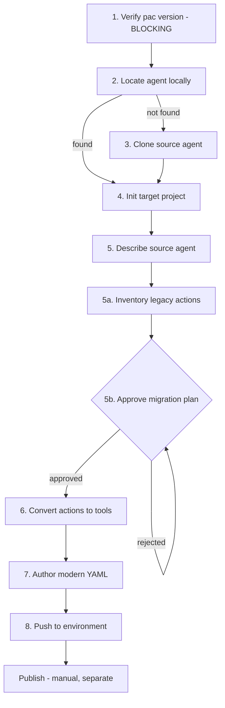

# Migrating Classic Agents to the Agentic Loop

<!-- Upstream: microsoft/copilot-studio-plugin — commands/migrate.md (accessed 2026-08-22).
     Adapted for Sopra conventions. See UPSTREAM_REFS.md entry 3. -->

> Converting a classic, topic-based Copilot Studio agent to the modern agentic-loop architecture is
> **a redesign, not a file conversion**. Topics, Power Fx, and variables have no direct equivalent.
> Plan it as a project, not a task.

Read [`agentic-loop.md`](agentic-loop.md) first.

---

## 1. Decide Whether to Migrate At All

Migration is worth it when:

- The agent's value is in judgement and conversation, not rigid scripted flow
- Topic sprawl has made the classic agent unmaintainable (see the anti-pattern in [`../ARCHITECTURE.md`](../ARCHITECTURE.md#8-anti-patterns))
- The team wants source-controlled, reviewable authoring
- Trigger-phrase misrouting is a recurring quality problem

**Do not migrate** when:

- The flow must remain deterministic for legal or contractual reasons
- The agent depends heavily on Power Fx or variable state with no clean tool equivalent
- The agent is stable, low-change, and delivering value — there is no prize for churn

Record the decision and its rationale before starting.

---

## 2. Hard Constraints

| Constraint | Impact |
|---|---|
| **Same-environment only** | Migrating into a *different* environment is not yet supported. Source and target must share an environment. |
| **`pac` > 2.9.3** | Blocking. Verify first. |
| **AI Prompt actions** | Not convertible — automatically skipped. Rebuild manually. |
| **Power Fx** | No equivalent. Every expression must be redesigned. |
| **Global / topic variables** | No equivalent. State must come from conversation history and tool outputs. |
| **Topics** | No equivalent. Redesign as instructions, knowledge, tools, and skills. |
| **Legacy plugin conflict** | The old `skills-for-copilot-studio` plugin supports classic orchestration only and can conflict. Remove or disable it. |

Because migration is same-environment, the migrated agent is created **alongside** the original, named
`<source display name> (migrated)`. The classic agent keeps running until you retire it deliberately —
which is the safe behaviour, and Sopra's required rollback path.

---

## 3. The Migration Workflow

The plugin's `/migrate` command orchestrates eight steps. Understand them even if you drive it
manually — the gates matter.



### Step 1 — Verify prerequisites (blocking)

```powershell
pac --version
```

Stop if the version is 2.9.3 or lower, or indeterminate.

Also check for the **legacy plugin**. If `skills-for-copilot-studio` is installed alongside
`mcs-assistant`, remove or disable it.

### Step 2–3 — Get the source agent locally

Look for an existing agent (`agent.mcs.yml`). If absent, clone it:

```powershell
pac copilot clone --bot "<bot-id>" --environment "<environment-id>" --output-dir "<output-root>"
```

### Step 4 — Initialize the target project

Read `displayName` from the source and `EnvironmentId` from the source `.mcs/conn.json`.

- Target display name: exactly `<source displayName> (migrated)`. If that exceeds **30 characters**,
  agree a shorter name first.
- Publisher prefix: **`spr`** for Sopra. 2–8 alphanumerics, must start with a letter, must not start
  with `mscrm`. Do not accept the `catmgr` default.

```powershell
pac copilot init `
  --name "<Source Name> (migrated)" `
  --publisher-prefix spr `
  --authoring-mode cli-copilot `
  --project-dir "<target-dir>" `
  --environment "<environment-id>"
```

This step will **stop rather than overwrite** if the target directory exists — that usually means the
migration already ran. Investigate before forcing anything.

### Step 5 — Describe the source agent

Produce a complete read-only inventory of the classic agent: every topic, action, knowledge source,
and instruction. This is the input to the redesign, and it is worth doing thoroughly — an incomplete
description produces a migrated agent with silent capability gaps.

The source folder is **read-only** throughout migration. Never modify it.

### Step 5a — Inventory legacy actions

```powershell
node scripts\convert-actions-to-tools.js <legacy-actions-folder> --list
```

For each legacy action this reports the source file, `mcs.metadata`, `modelDisplayName`,
`modelDescription`, `operationId` or `flowId`, support status, and likely relevance.

### Step 5b — Approve the migration plan (mandatory gate)

**Nothing may be authored before this is approved.** The plan must contain:

1. **Purpose** — one paragraph on what the migrated agent is for.
2. **Capabilities table** — what the agent can do, in plain language. No variables, connectors, flows,
   or topics in this table; describe behaviour, not plumbing.
3. **Tool/action decisions** — per legacy action, one of:

   | Decision | Meaning |
   |---|---|
   | `migrate` | Convert to a modern tool |
   | `skip` | Intentionally excluded |
   | `manual` | Rebuild another way, or accept as a gap |
   | `unsupported` | Cannot be auto-converted; needs manual refactor |

4. **Plan for open gaps** — concrete proposals, not open questions.

Sopra additions to this gate:
- The plan must be **reviewed by someone who did not write it**.
- Every `skip` needs a stated reason.
- Store the plan as `MIGRATION-PLAN-<id>.md` **as a sibling of the project directory, never inside
  it** — otherwise it gets pushed to the environment.

This file also makes the migration **resumable**; it is updated after each major step.

### Step 6 — Convert actions to tools

```powershell
# All supported actions
node scripts\convert-actions-to-tools.js <legacy-actions> <new-tools> --all --report <report.json>

# A selected subset
node scripts\convert-actions-to-tools.js <legacy-actions> <new-tools> --include "<a.mcs.yml>" "<b.mcs.yml>" --report <report.json>

# Everything except a few
node scripts\convert-actions-to-tools.js <legacy-actions> <new-tools> --exclude "<skipped.mcs.yml>" --report <report.json>
```

> **Never combine `--clean` with `--include` or `--exclude`.** A partial migration would delete tools
> outside the selected subset.

What the converter does:

| Legacy type | Result |
|---|---|
| Connector action | `ConnectorTool` YAML |
| MCP action | MCP tool YAML |
| Workflow action (`InvokeFlowTaskAction`) | `WorkflowTool` YAML — reads `workflow.json` but does **not** copy it across |
| AI Prompt | **Skipped** — unsupported |
| Other unsupported types | Skipped |

Then handle connection references — see [`../cli-authoring.md`](../cli-authoring.md#7-connection-references).
For every converted connector tool, confirm a usable connection exists in the target environment
**before** push, or push will fail.

### Step 7 — Author the modern YAML

This is the actual redesign: turn the described capabilities into instructions, knowledge, tools, and
skills using the [decision tree](agentic-loop.md#4-the-decision-tree).

Non-negotiables:

- **Rewrite every `WorkflowTool` description.** Converter-generated descriptions come from the classic
  workflow package and are **placeholders**. A vague tool description directly degrades tool selection.
- **Do not reintroduce actions the approved plan skipped.**
- **Do not modify the source agent.**
- **Do not hand-edit `.mcs/`.**
- **Do not leave the output as a design document.** The deliverable is YAML on disk.
- **Do not create design notes or JSON meta-files inside the project.**

### Step 8 — Push

Pre-push validation: every `.mcs.yml` stem must start with `spr` and be ≤ 100 characters. Rename
first if needed.

```powershell
pac copilot pull --project-dir "<target-dir>"
pac copilot push  --project-dir "<target-dir>"
```

**Publishing is deliberately not part of migration.** The workflow stops at push. Publish only after
testing — see below.

---

## 4. After the Push

1. **Publish to DEV** and test — the agent must be published before it can be chatted with.
2. **Run the capability checklist** from the approved plan. Every row in the capabilities table should
   be exercised at least once.
3. **Regression-test the gaps.** Skipped and manual items are where migrated agents silently lose
   behaviour.
4. **Compare against the classic agent** on a representative set of real utterances.
5. Only then promote through TEST → UAT → PROD per
   [`../../solutions/ARCHITECTURE.md`](../../solutions/ARCHITECTURE.md).

**Keep the classic agent available until the migrated agent has passed UAT.** It is the rollback plan.

---

## 5. Common Failure Modes

| Symptom | Cause | Fix |
|---|---|---|
| `A record with the specified key values does not exist in connectionreference entity` | Connection reference missing in target environment | Create it before push (§7 of the CLI guide) |
| Push rejects files | File stem missing the publisher prefix, or > 100 chars | Rename to `spr_<name>.mcs.yml` |
| `pac copilot init` refuses to run | Target directory already exists | Migration likely already ran — investigate, do not overwrite |
| Chat returns HTTP 404 | Agent not published | Publish, then retry |
| Agent picks the wrong tool | Placeholder `WorkflowTool` descriptions | Rewrite descriptions purposefully |
| Capability silently missing | AI Prompt action auto-skipped | Rebuild manually as a tool or skill |
| Workflow action marked `unsupported` | `workflows/` folder renamed, so `flowId` cannot be matched | Match semantically by hand, or log as a gap |
| Migrated agent ignores a rule the classic one enforced | Rule was enforced by topic structure, not stated anywhere | Write it explicitly into instructions |

That last row is the most common and most dangerous. Classic agents enforce a great deal implicitly
through flow structure. The agentic loop enforces nothing you have not written down.

---

## 6. Sopra Migration Checklist

- [ ] Migration decision and rationale recorded
- [ ] `pac` version verified > 2.9.3
- [ ] Legacy `skills-for-copilot-studio` plugin removed or disabled
- [ ] Source agent cloned; source folder treated as read-only
- [ ] Publisher prefix set to `spr`, not `catmgr`
- [ ] Source agent fully described
- [ ] Migration plan peer-reviewed and approved; every `skip` justified
- [ ] `MIGRATION-PLAN-*.md` stored **outside** the project directory
- [ ] Connection references created as dedicated records in the target environment
- [ ] Every `WorkflowTool` description rewritten
- [ ] All file stems prefixed and ≤ 100 characters
- [ ] Pull before push
- [ ] Published to DEV and tested against the capabilities table
- [ ] Gaps regression-tested
- [ ] Classic agent retained until UAT sign-off
- [ ] Solution packaged with `spr_` prefix for promotion

---

## 7. Related

- [`agentic-loop.md`](agentic-loop.md) — target architecture
- [`../cli-authoring.md`](../cli-authoring.md) — commands, layout, connection references
- [`testing-strategy.md`](testing-strategy.md) — test approach
- [`../ARCHITECTURE.md`](../ARCHITECTURE.md) — classic architecture reference

---

## Upstream Reference

- **Source:** `microsoft/copilot-studio-plugin` — `commands/migrate.md`
- **Accessed:** 2026-08-22 (plugin `mcs-assistant` v1.0.2)
- **Sopra Divergence:** Added the "decide whether to migrate at all" gate in §1, peer review of the
  migration plan, the post-push verification protocol in §4, and the rollback requirement to retain
  the classic agent until UAT sign-off. Upstream describes the mechanics but not the governance.
- **⚠️ Caveat:** Same-environment migration only, and the YAML schema may change without notice.
  Re-verify each quarter.
