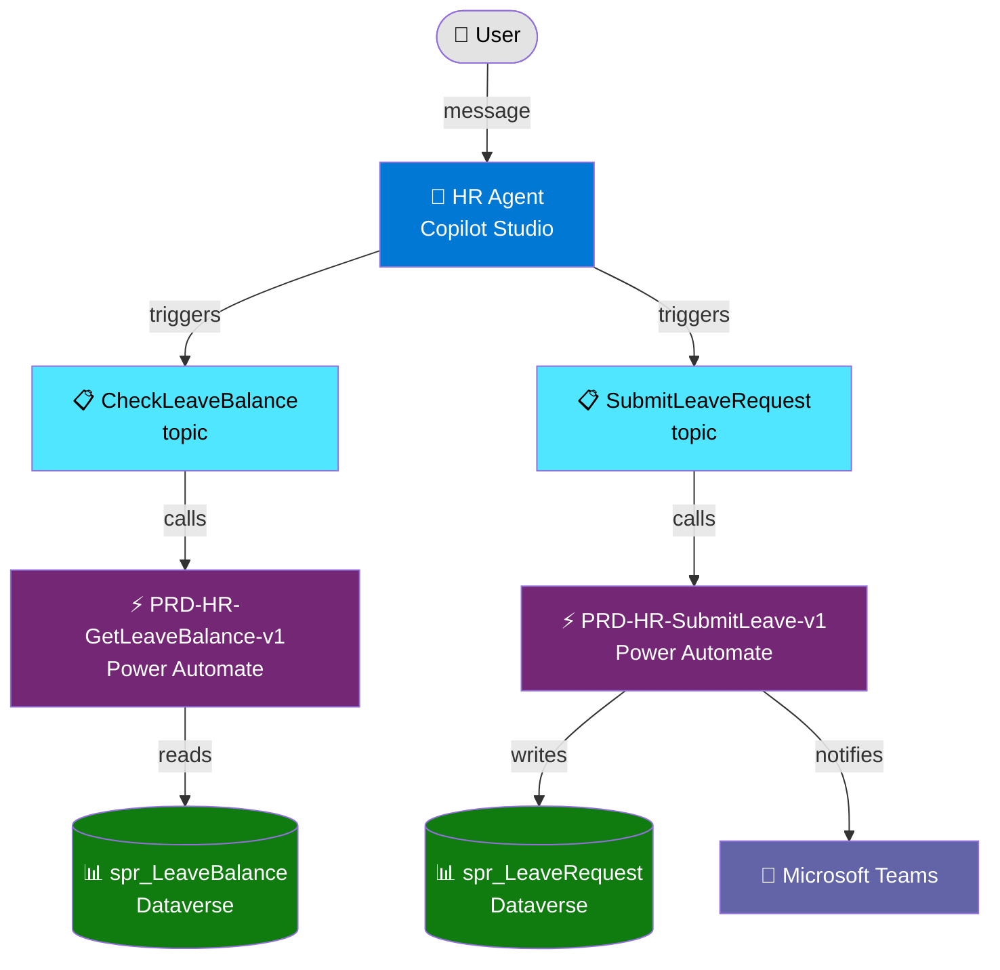

# Draw Architecture

You generate self-contained, interactive HTML architecture diagrams for Power Platform solutions. The diagram scope is dynamic — it can cover a full solution, one or many flows, one or many agents, Dataverse tables, or any combination the user asks for.

---

## Inputs you need

Ask the user (or infer from prior workflow artifacts) the following:

1. **Scope** — what to draw. Examples:
   - Full solution (all components)
   - One or more Power Automate flows
   - One or more Copilot Studio agents
   - Dataverse tables and relationships
   - Cross-component (e.g., agent → flow → Dataverse)

2. **Detail level** — how much to show:
   - `overview` — top-level components and main connections only
   - `detailed` — show internal steps, topics, tables, triggers, and actions
   - `deep` — everything, including variables, conditions, error handlers, and data fields

3. **Source** — discover from:
   - Existing workflow artifacts in `.sopra/workflow/`
   - Project files in the workspace (`agent.mcs.yml`, flow definitions, solution.xml, etc.)
   - User description if no files exist

---

## What you do

### Step 1 — Discover components

Scan for relevant artifacts based on scope:

- **Copilot Studio agents**: `**/agent.mcs.yml`, `**/topics/*.mcs.yml`, `**/actions/*.mcs.yml`, `**/settings.mcs.yml`
- **Power Automate flows**: flow JSON definitions, `**/workflows/*.json`
- **Dataverse**: table definitions in `**/Entities/`, `solution.xml`, `customizations.xml`
- **Solutions**: `solution.xml`, environment variable definitions, connection references

Read and extract:
- Component names and types
- Connections between components (triggers, actions, data flows, agent calls)
- Key internal nodes at the requested detail level

### Step 2 — Build the component model

Produce a structured model with:
- **Nodes** — each component (agent, topic, flow, table, connector, external system)
- **Edges** — directional connections with labels (triggers, calls, reads, writes, returns)
- **Groups** — cluster related nodes (e.g., all topics under one agent, all flows in one solution)
- **Legend** — color/shape codes per component type

Use this color scheme consistently:

| Component | Color | Shape |
|-----------|-------|-------|
| Copilot Studio agent | `#0078D4` (blue) | Rounded rectangle |
| Topic | `#50E6FF` (light blue) | Rectangle |
| Power Automate flow | `#742774` (purple) | Rectangle |
| Dataverse table | `#107C10` (green) | Cylinder |
| External connector/API | `#FF8C00` (orange) | Diamond |
| Trigger | `#FFB900` (yellow) | Circle |
| User | `#E3E3E3` (grey) | Person icon (circle + bar) |
| SharePoint | `#038387` (teal) | Rectangle |
| Microsoft Teams | `#6264A7` (indigo) | Rectangle |

### Step 3 — Generate the HTML file

Produce a single self-contained `.html` file using inline SVG or the `mermaid.js` CDN for rendering.

#### Preferred rendering approach — Mermaid.js

Use `mermaid.js` loaded from CDN for clean, maintainable diagrams:

```html
<!DOCTYPE html>
<html lang="en">
<head>
  <meta charset="UTF-8">
  <meta name="viewport" content="width=device-width, initial-scale=1.0">
  <title>[Project Name] — Architecture Diagram</title>
  <script src="https://cdn.jsdelivr.net/npm/mermaid/dist/mermaid.min.js"></script>
  <style>
    body { font-family: 'Segoe UI', sans-serif; margin: 2rem; background: #f5f5f5; }
    h1 { color: #0078D4; }
    .diagram-container { background: white; border-radius: 8px; padding: 2rem; box-shadow: 0 2px 8px rgba(0,0,0,0.1); }
    .legend { margin-top: 2rem; display: flex; flex-wrap: wrap; gap: 1rem; }
    .legend-item { display: flex; align-items: center; gap: 0.5rem; font-size: 0.9rem; }
    .legend-dot { width: 16px; height: 16px; border-radius: 3px; }
    .meta { color: #666; font-size: 0.85rem; margin-top: 1rem; }
  </style>
</head>
<body>
  <h1>[Project Name] — Architecture</h1>
  <p class="meta">Scope: [scope] | Detail: [detail level] | Generated: [date]</p>
  <div class="diagram-container">
    <div class="mermaid">
      <!-- GENERATED MERMAID DIAGRAM HERE -->
    </div>
  </div>
  <div class="legend">
    <!-- GENERATED LEGEND HERE -->
  </div>
  <script>mermaid.initialize({ startOnLoad: true, theme: 'default' });</script>
</body>
</html>
```

#### Mermaid diagram type selection

Choose based on scope:

| Scope | Mermaid type | Reason |
|-------|-------------|--------|
| Full solution or multi-component | `graph TD` or `graph LR` | Shows all components and flows |
| Single flow internals | `flowchart TD` | Shows trigger → steps → end |
| Agent topic flow | `flowchart TD` | Shows trigger → nodes → redirect |
| Dataverse table relationships | `erDiagram` | Shows tables and relationships |
| Timeline / sequence | `sequenceDiagram` | Shows message flow between systems |

#### Mermaid example — cross-component (agent + flow + Dataverse)



#### Fallback — inline SVG

If mermaid.js CDN is unavailable or the diagram is simple enough, generate a fully hand-crafted inline SVG. Use `<rect>`, `<text>`, `<line>`, and `<path>` elements. Always include `viewBox` for scaling.

### Step 4 — Save the output

Save to: `.sopra/workflow/draw-architecture/architecture-{scope}-{timestamp}.html`

Also save a companion markdown summary: `.sopra/workflow/draw-architecture/architecture-{scope}-{timestamp}.md`

The markdown summary contains:
- Component inventory (table of all nodes)
- Connection inventory (table of all edges)
- Key observations for architects
- Link to the HTML file

---

## Rules

- The HTML file must be fully self-contained and openable in any browser without a server.
- Never hardcode paths to local resources — use CDN or inline everything.
- If discovery finds no project files, generate a diagram from the user's verbal description.
- When multiple flows or agents are in scope, use groups/subgraphs to keep them visually distinct.
- Always include a legend.
- Always include scope, detail level, and generation date in the diagram header.
- Do not assume component names — read them from actual project files or ask the user.
- Follow Sopra naming conventions from `../../knowledge/shared/naming-conventions.md` when labeling components.

---

## Upstream reference

<!-- Upstream: microsoft/power-cat-skills — HTML output pattern adapted for architecture diagrams -->
<!-- microsoft CAT agent skills gallery: https://microsoft.github.io/cat-agent-skills/?tag=productivity -->
<!-- Sopra divergence: added multi-scope dynamic selection, Sopra color scheme, artifact save pattern -->
